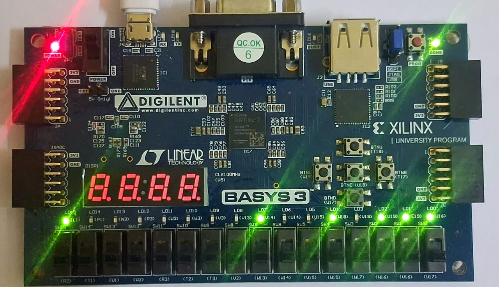

# AES-128 Crypto Accelerator SoC

**Full RTL -> GDSII on Sky130 · Timing-closed (9 corners, 0 violations) · DRC clean / LVS match · DFT: 745/745 scan-mapped + March C- MBIST · 4/4 NIST known-answer vectors · 200 ns measured on FPGA · Post-layout power analysis**

      

An AES-128 encryption accelerator SoC built by a two-person team (RTL/synthesis/STA by **Nandikha M**, physical design/DFT/signoff/demo by **Akif Mohamed J**): verified against NIST known-answer vectors, implemented through a complete open-source RTL-to-GDSII flow on Sky130, measured on a real FPGA board, and extended in v2 with design-for-test — memory BIST plus full scan-cell mapping — and post-layout power analysis. Every number below traces to a committed testbench or run log.

---

## Results (v2, all values from artifacts)

| Metric | Baseline (no DFT) | DFT-enabled |
|---|---|---|
| Die / core | 240,307 / 224,240 um2 | 326,366 / 307,825 um2 |
| Core utilization | **67.6%** | 51.9% (compensated for scan-cell area) |
| Sequential elements | 745 flip-flops | **745/745 scan-mapped (100%)**: 731 `sdfrtp_2` + 14 `sdfsbp_2` |
| Setup slack (worst / tt) | -- / +14.07 ns | **+7.22 ns / +14.06 ns** |
| Hold slack (worst) | +0.29 ns | +0.107 ns |
| Timing violations | 0 | **0 across all 9 corners** |
| DRC (Magic + KLayout) | 0 | **0** |
| LVS | match | **match** |
| Antenna | 2 marginal residuals (met3 414.9/400, met1 411.2/400) | 1 net + 1 pin, documented |
| Wirelength | -- | 560,956 um (routing: 16062 -> 0 DRC in 7 iterations) |
| IR drop worst | -- | 0.021% |
| Power (analysis, activity 0.1) | -- | **6.08 mW tt / 4.94 ss / 7.00 ff = 0.122 mW/MHz, 1.22 nJ/block** |
| MBIST | March C-, fault-injection verified (stuck-at-0 @ addr 42 detected) | same |

**Latency / throughput (measured):** 10 cycles = **200 ns @ 50 MHz** = 0.64 Gbps — counted by an in-design cycle counter on the FPGA and independently reproduced in simulation (`tb/tb_aes_soc_v2_1.v` prints the same 10-cycle busy window).

**Software comparison (cited, not invented):** measured mbedTLS AES-128 on Cortex-M4 = 71 cycles/byte = 1,136 cycles/block; fastest published bitsliced = 80 cycles/byte = 1,280 cycles/block. Against this design's 10 cycles/block: **114x (vs measured mbedTLS) to 128x (vs best published software)** in cycle count. Details: `docs/SPEEDUP_BENCHMARK.md`.

**Functional verification:** 4/4 known-answer vectors — NIST SP 800-38A ECB TV1, FIPS-197 Appendix B, all-zero KAT, all-ones KAT (`tb/tb_aes_core_v2.v`, Icarus Verilog 11.0 and 12.0). On FPGA hardware: NIST TV1 end-to-end (UART + LEDs).

---

## FPGA Demo - Basys3 Hardware Verification (NIST TV1)

Verified on hardware (20 Aug 2026), Digilent Basys3 (Artix-7 XC7A35T) at 50 MHz, driven over USB-UART (115200 8N1) by `fpga/uart_test.py`:

```
status: AA
cipher: 3AD77BB40D7A3660A89ECAF32466EF97
expect: 3AD77BB40D7A3660A89ECAF32466EF97
RESULT: PASS
cycles: 10 (200 ns @ 50 MHz) - measured on FPGA
```

**The chip reports its own encryption time**: the wrapper counts 50 MHz cycles while the AES core is busy and transmits the count after the ciphertext.

**LEDs (LD0-LD7 = final/last ciphertext byte):** `1001 0111` = `0x97` — the last byte of the NIST TV1 ciphertext (the RTL drives `led_data <= aes_cipher[7:0]`), latched for visibility by the FPGA wrapper. `led_done` LD15, `led_busy` LD13, `led_error` LD14.



Files: `fpga/aes_soc_fpga.v` (wrapper: 100->50 MHz divider, LED latch, cycle counter), `fpga/basys3.xdc`, `fpga/clk50_impl.xdc`, `fpga/build_basys3.tcl`, `fpga/uart_test.py`, `sw/pc_demo.py`.

---

## Design-for-Test (v2)

- **Memory BIST:** March C- controller around the 256x8 SRAM (`rtl/mbist_ctrl.v`, `rtl/ram_wrapper.v`, `rtl/ram_256x8.v`). Verified in simulation with behavioral fault injection: clean memory passes; injected stuck-at-0 at address 42 bit 0 is detected and the failing address reported (`tb/tb_mbist.v`).
- **Scan-cell mapping:** all 745 flip-flops replaced by scan flip-flops via OpenROAD `scan_replace`, executed as a custom OpenLane 2 flow step (`dft/openlane2_plugin/`) on the synthesized netlist — **zero RTL changes**. Flows: `pnr/config_probe_scan.json` (synthesis + scan-replace probe) and `pnr/config_scan.json` (full 79-step flow; completed 79/79 twice, runs `scan_v2_0822f` and `scan_v2_0822g`).
- **Chain stitching - attempted and characterized:** OpenROAD `insert_dft` was invoked at two flow points (post-detailed-placement and post-CTS); the bundled OpenROAD build rejects scan-cell creation in both cases (DFT-0005 for every flop), so the released GDS holds scan-mapped flops with unconnected scan pins (745 x 2 = 1490, disclosed). Stitching requires a newer OpenROAD build. Reproduction and logs: `dft/README.md`, `dft/run_scan_probe.sh`, `dft/dft_report.sh`.
- **Power analysis:** OpenSTA on routed DEF + extracted SPEF, 3 corners — `dft/power_report.sh` (analysis, not silicon measurement; method disclosed).

---

## Architecture

```
        +--------------------------------------------+
  UART  |  aes_soc (top)                             |
 rx --->|  uart_rx ---> CTRL FSM ---> aes_core       |
        |  (2-FF sync)    |     +------------------+ |
 tx <---|  uart_tx <------+     | add_round_key    | |
        |                      | sub_bytes (16xSB)| |
 LED <--|                      | shift_rows (wiring)| |
        |  key_expand -------> | mix_columns GF(28)| |
        |  (on-the-fly)        +------------------+ |
        |  March C- MBIST + 256x8 SRAM               |
        |  745 flops -> scan flops (sdf, 100%)       |
        +--------------------------------------------+
```

- **Iterative 1-round datapath:** one round unit reused for 10 rounds; 10-cycle busy window (measured). Chosen over pipelined (~10x area) for IoT targets.
- **SubBytes:** 16 parallel S-boxes. **ShiftRows:** pure wiring (0 cells). **MixColumns:** GF(2^8) with shared xtime. **Key expansion:** on-the-fly (Rcon 01..36).
- **SoC shell:** UART 115200 @ 50 MHz (BAUD_DIV 434), 2-FF sync. Protocol: `0xAE` + key(16B) + plaintext(16B) -> `0xAA` + ciphertext(16B). `0x55` asserts error only. The **final ciphertext byte** drives the LEDs (TV1 -> `0x97`).

## Layout

| Full chip (KLayout) | Metal routing | Std cells | Antenna diodes |
|---|---|---|---|
|  |  |  |  |

Also: `virtuoso/screenshots/` (Cadence Virtuoso 6.1.5 XStream import).

## Repository Structure

```
rtl/        Verilog: crypto core, UART, SoC top, MBIST (mbist_ctrl, ram_wrapper, ram_256x8)
tb/         Testbenches: tb_aes_soc_v2_1.v (SoC NIST TV1), tb_aes_core_v2.v (4 vectors),
            tb_mbist.v (fault injection); legacy tb_aes_soc.v / tb_aes_core.v kept for history
synth/      Yosys script + v1 report (historical)
timing/     OpenSTA scripts + SDC
pnr/        OpenLane 2.3.10 configs: config.json (baseline 67.6%), config_scan.json (79-step
            DFT flow), config_scan_cts.json (post-CTS stitch experiment), config_probe_scan.json
dft/        DFT kit: OpenLane plugin (scan steps), standalone probe, report + power scripts
paper/      v2 IEEE conference paper (LaTeX + PDF)
gds/        GDSII (v1 first-pass, Git LFS); v2/DFT run GDS in pnr/runs/
fpga/       Basys3 wrapper, XDC, build script, host test
sw/         pc_demo.py
docs/       Architecture, NIST verification, benchmark basis, flow doc, Virtuoso guide, demo log
run_sim.sh  Simulation entry point (all three testbenches)
```

## Tool Flow

| Stage | Tool | Notes |
|---|---|---|
| Simulation | Icarus Verilog 11/12 | 4/4 KAT vectors; SoC TV1; MBIST fault injection |
| Synthesis | Yosys 0.46 | sky130_fd_sc_hd |
| STA | OpenSTA (9 corners) | 0 violations both configs |
| PnR + DFT | OpenLane 2.3.10 + OpenROAD (`scan_replace`, custom steps) | 79/79 flow, twice |
| DRC / LVS | Magic 8.3.489 / KLayout / Netgen 1.5.278 | 0 / match |
| Power | OpenSTA + SPEF | 3 corners, method disclosed |
| FPGA | Vivado 2017.4 (Basys3) | measured 200 ns |

## Reproducing

```bash
bash run_sim.sh                                   # all three testbenches (expect 3x PASS)
# or individually:
iverilog -o s.vvp tb/tb_aes_soc_v2_1.v rtl/crypto/*.v rtl/peripheral/*.v rtl/top/*.v && vvp s.vvp
iverilog -o c.vvp tb/tb_aes_core_v2.v rtl/crypto/*.v && vvp c.vvp
iverilog -o m.vvp tb/tb_mbist.v rtl/mbist_ctrl.v rtl/ram_wrapper.v rtl/ram_256x8.v && vvp m.vvp

openlane pnr/config.json                          # baseline flow (~30 min)
export PYTHONPATH=$PWD/dft/openlane2_plugin:$PYTHONPATH
openlane pnr/config_scan.json --run-tag scan_run  # DFT flow (79 steps)
bash dft/dft_report.sh pnr/runs/scan_run          # signoff metrics
bash dft/power_report.sh pnr/runs/scan_run        # power analysis (3 corners)
```

FPGA: `vivado -mode batch -source fpga/build_basys3.tcl`, program, then `python3 fpga/uart_test.py`.

## Engineering Notes (highlights)

- **Utilization fix:** absolute DIE_AREA/CORE_AREA inputs were silently ignored (20.2% stuck); relative sizing closed at 67.6% — verify utilization from placement logs, not config inputs.
- **Scan-area compensation:** scan replacement grows synthesized cell area 44% (116.8k -> 168.0 um2); floorplan target compensated 54 -> 38 so the DFT build stays routable.
- **Testbench discipline:** the original SoC testbench had 3 deterministic bugs (missed busy pulse, UART re-arm at 10.5 vs 10.02 bit periods, pulse-vs-level done) — the fixed TB (`tb_aes_soc_v2_1.v`) passes on iverilog 11 and 12 and is the reference.
- **Honest negatives:** chain stitching characterized at two insertion points (DFT-0005); EQY inapplicable pre-stitch; 109 nets unannotated in RC extraction. All disclosed.
- **On-FPGA measurement:** in-design cycle counter -> 10 cycles = 200 ns @ 50 MHz (measured, not estimated).
- **Protocol alignment:** host reads 19 bytes (AA + cipher + 2-byte cycle count); no reply to `0x55` by design.

## Team

| | |
|---|---|
| **Nandikha M** | RTL design (15 NIST-verified modules), Yosys synthesis, OpenSTA timing |
| **Akif Mohamed J** | Physical design + signoff, DFT (MBIST + scan flow), power analysis, FPGA demo, v2 testbenches |

Division of labor reflected in the branch history: `feature/aes-rtl-synth-timing` (RTL, synthesis, STA) and `feature/aes-pnr-gds-virtuoso` (physical design, signoff, demo).

## History

- **v1** (branch history): first-pass flow, 1 mm2 die, 20.2% utilization, GDS in `gds/`.
- **v2 (Aug 2026, tag `v2.0`)**: utilization fix to 67.6%, verified testbenches, MBIST, full scan-cell mapping with two complete 79/79 signed-off flows, power analysis, corrected benchmark basis, IEEE paper (`paper/`).

*Educational tapeout-style project. No silicon fabrication is claimed; FPGA measurements are real hardware measurements. Every reported number is reproducible from this repository.*
