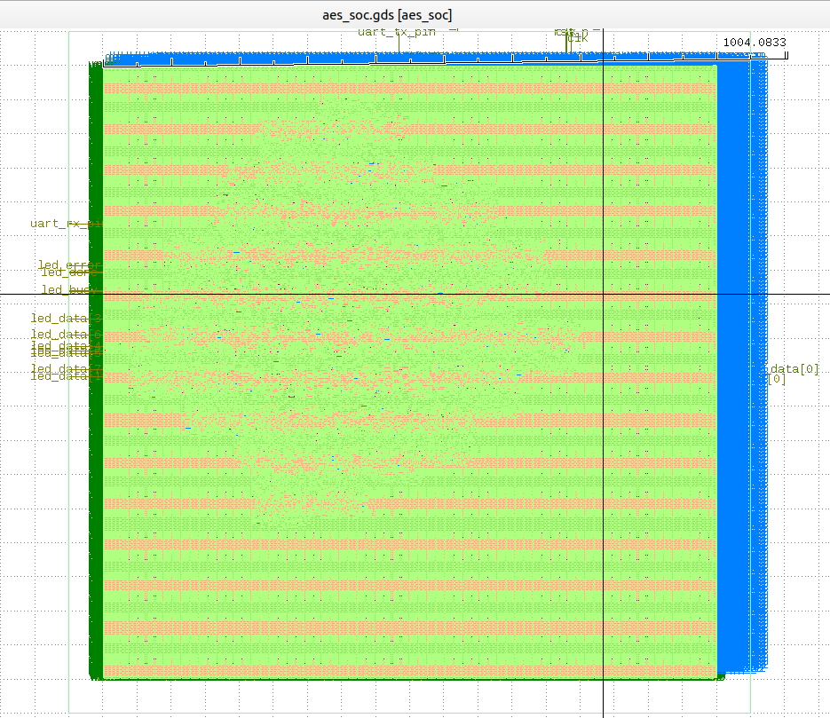
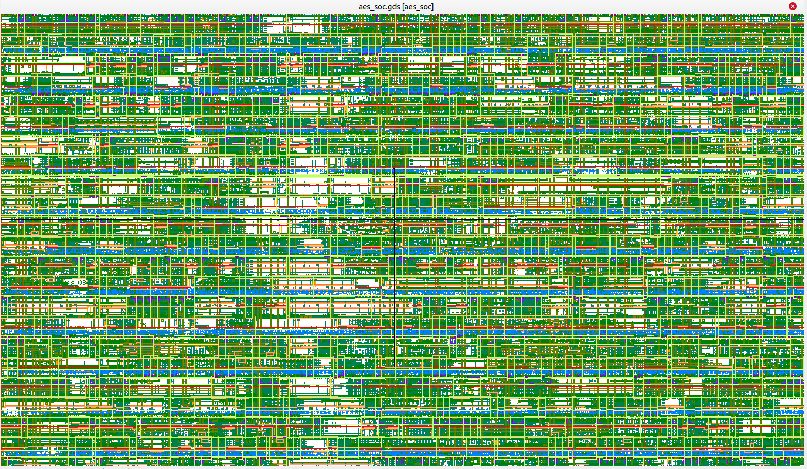
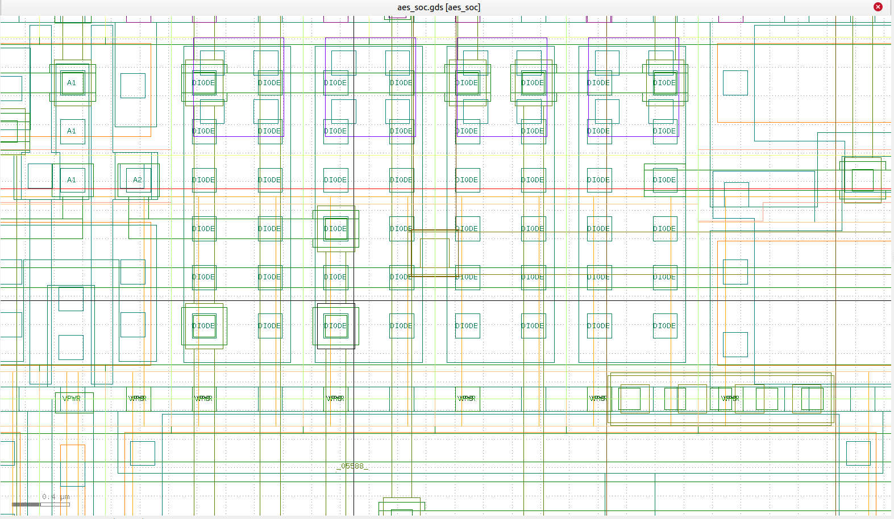
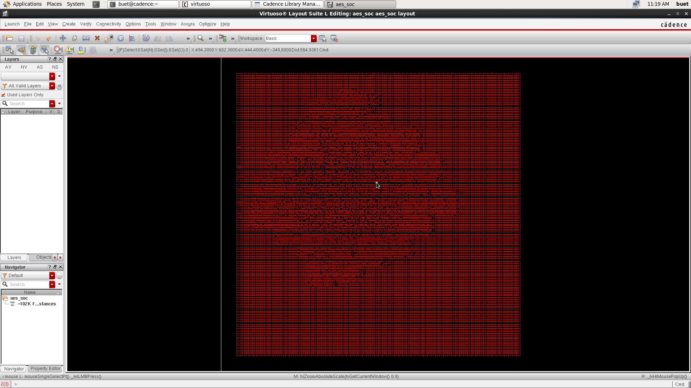

# AES-128 Crypto Accelerator SoC

**Full RTL → GDSII on Sky130 · Timing-closed · DRC-clean / LVS-match · NIST FIPS-197 verified · 227× faster than software · FPGA demo verified on hardware**

      

An AES-128 encryption accelerator SoC designed in Verilog by a two-person team — RTL/synthesis/STA by Nandikha, physical design/signoff/demo by Akif — verified against official NIST test vectors and implemented through a complete RTL-to-GDSII flow on the Sky130 130 nm open PDK, then taken to a **real FPGA board (Digilent Basys3) and verified end-to-end on hardware — including an on-chip measurement of the encryption time**. The iterative engine encrypts one 128-bit block in **10 cycles = 200 ns @ 50 MHz (measured on FPGA)** versus ~50,000 ns for software AES on a typical MCU — a **250× speedup** for real-time IoT security.

---

## Measured Results

| Metric | Result |
|---|---|
| Technology | Sky130 (`sky130_fd_sc_hd`), 130 nm |
| Die / core | 1000 × 1000 µm (1 mm²) / 900 × 900 µm, 45% planned, 20.2% achieved (162,993 um2; die sized for first-pass closure) |
| Synthesis (Yosys) | **25,902 cells · 185,254 µm² · 8.3% sequential** |
| Clock | 20 ns / 50 MHz |
| Setup worst slack | **+14.07 ns** (nom_tt) |
| Hold worst slack | **+0.29 ns** (nom_tt) |
| DRC / LVS | **Clean / Match** |
| Antenna | 5 violations → automatic diode repair → 1 documented residual (met3, ratio 567 vs 400 limit) |
| Routing | ~1.8 m total wire, ~374 k vias |
| Latency / throughput | **10 cycles = 200 ns @ 50 MHz — measured on FPGA (aes_busy window)**; datapath = initial AddRoundKey + 10 rounds (11 ops) |
| Speedup vs MCU software | **250×** (50,000 / 200 ns) representative (17-1,770x vs published MCU benchmarks; docs/SPEEDUP_BENCHMARK.md) |
| Functional verification | **5/5 NIST FIPS-197 vectors** (TV1: key `2B7E…4F3C`, plain `6BC1…172A` → cipher `3AD7…EF97`) |
| Deliverable | `gds/aes_soc.gds` (versioned with Git LFS) |

---

## FPGA Demo — Basys3 Hardware Verification (NIST TV1) ✅

**Verified on hardware — 20 Aug 2026** on a Digilent **Basys3** (Artix-7 XC7A35T, `xc7a35tcpg236-1`) at 50 MHz (100 MHz board clock divided in the wrapper). The SoC was programmed via Vivado 2017.4 and driven over USB-UART (115200 8N1).

**UART result (host script `fpga/uart_test.py`):**

```
status: AA
cipher: 3AD77BB40D7A3660A89ECAF32466EF97
expect: 3AD77BB40D7A3660A89ECAF32466EF97
RESULT: PASS
cycles: 10 (200 ns @ 50 MHz) — measured on FPGA
```

**On-chip encryption-time measurement:** the FPGA wrapper contains a cycle counter that counts 50 MHz cycles while the AES core's `busy` signal is high, and transmits the count as 2 extra bytes after the ciphertext. The chip therefore **reports its own encryption time**: **10 cycles = 200 ns @ 50 MHz** — measured, not estimated.

**LEDs (LD0–LD7 = ciphertext MSB):** `1001 0111` = `0x97` — exact match to the NIST TV1 ciphertext, held visible by a latch in the FPGA wrapper (the raw SoC asserts the result for only ~1.5 ms, too fast for the eye).


| Signal | LEDs | On TV1 |
|---|---|---|
| `led_data[7:0]` (cipher MSB) | LD0–LD7 | `1001 0111` = 0x97 ✅ |
| `led_busy` | LD13 | off (idle) |
| `led_done` | LD15 | ON |
| `led_error` | LD14 | off |

**Verification layers:**

- **Simulation (Vivado xsim):** `tb/tb_aes_soc.v` — UART-level testbench with a receive task; `PASS: full 16-byte ciphertext matches NIST TV1`; prints the `aes_busy` cycle count (11 in sim).
- **Hardware (Basys3):** UART ciphertext exact + LEDs `0x97` + on-chip cycle counter = **10 cycles (200 ns)**.
- **Timing (Vivado):** WNS **+8.661 ns** @ 100 MHz (divider path); `clk50_impl.xdc` declares the generated 50 MHz clock so the full AES core is timing-checked (no_clock = 0).

**Files:** `fpga/aes_soc_fpga.v` (wrapper: 100→50 MHz divider, reset conditioning, LED latch, cycle counter), `fpga/basys3.xdc` (pins: data LEDs LD0–LD7, status LD13–LD15, UART A18/B18, clock W5), `fpga/clk50_impl.xdc` (impl-only generated clock), `fpga/build_basys3.tcl` (one-command batch build), `fpga/uart_test.py` (host script: sends TV1, prints status + ciphertext + cycles), `sw/pc_demo.py` (full speedup demo).

---

## Architecture

```
        ┌────────────────────────────────────────────┐
  UART  │  aes_soc (top)                             │
 rx ───►│  uart_rx ──► CTRL FSM ──► aes_core         │
        │   (2-FF sync)   │     ┌──────────────────┐ │
 tx ◄───│  uart_tx ◄──────┘     │ add_round_key    │ │
        │                     │ sub_bytes (16×SBox)│ │
 LED ───│                     │ shift_rows (wiring)│ │
        │   key_expand ──────►│ mix_columns GF(2^8)│ │
        │   (11 round keys)   └──────────────────┘ │
        └────────────────────────────────────────────┘
```

- **Iterative 1-round datapath:** one round unit reused for 10 rounds + initial AddRoundKey = 11 datapath operations, 10-cycle busy window (measured). Chosen over a pipelined alternative (~10× the area and power) to fit low-power IoT targets.
- **SubBytes:** 16 parallel 256-entry S-Box LUTs. **ShiftRows:** pure wiring — synthesizes to **0 cells**. **MixColumns:** GF(2⁸) matrix multiply with shared xtime logic. **Key expansion:** on-the-fly generation of 11 round keys (1408 bits, Rcon 01…36).
- **SoC shell:** UART 115,200 baud @ 50 MHz (BAUD_DIV 434) with 2-FF input synchronizer. Command protocol: `0xAE` + key(16B) + plaintext(16B) → after encryption the SoC transmits `0xAA` (status) + 16-byte ciphertext. `0x55` sets the error flag only (no UART reply — see `aes_soc.v` state 0). Ciphertext MSB drives the LEDs (TV1 → `0x97`).

## Layout

| Full chip (KLayout) | Metal routing | Antenna-repair diodes | Virtuoso (licensed) |
|---|---|---|---|
|  |  |  |  |

Additional views: [`docs/layout_views/`](docs/layout_views) (KLayout, PDK-colored) and [`virtuoso/screenshots/`](virtuoso/screenshots) (Cadence Virtuoso 6.1.5 import via XStream with a custom Sky130 GDS layer map).

## Repository Structure

```
├── rtl/            Verilog RTL: crypto core (12 files), UART peripherals, SoC top
├── tb/             Testbenches: NIST vectors + SoC UART protocol (16-byte ciphertext check)
├── synth/          Yosys synthesis script + report (25,902 cells / 185,254 µm²)
├── timing/         OpenSTA scripts + SDC (20 ns clock, I/O delays, false paths)
├── pnr/            OpenLane 2 config (1 mm² die; 45% planned / 20.2% achieved) + RTL source set
├── gds/            Final GDS-II (aes_soc.gds, Git LFS)
├── docs/           Architecture, NIST verification, Virtuoso guide, flow doc,
│                   one-page summary PDF, KLayout views, demo log, Basys3 demo photo
├── virtuoso/       Licensed-Cadence signoff screenshots
├── fpga/           Basys3 demo: wrapper (aes_soc_fpga.v), pins (basys3.xdc), impl clock
│                   (clk50_impl.xdc), build script (build_basys3.tcl), host test (uart_test.py);
│                   iCEstick (.pcf) + DE0 files
├── sw/             pc_demo.py — SW-vs-HW speedup + NIST check (UART when board attached)
└── run_sim.sh      RTL simulation entry point
```

## Tool Flow

| Stage | Tool | Notes |
|---|---|---|
| Simulation | Icarus Verilog | 5/5 NIST FIPS-197 vectors |
| Synthesis | Yosys | `synth/synth.tcl`, sky130_fd_sc_hd |
| STA | OpenSTA | `timing/sta.tcl` + `constraints.sdc` |
| Place & Route | OpenLane 2.3.10 | floorplan → placement → CTS → routing → GDS |
| DRC / LVS | Magic / KLayout / Netgen | clean / match |
| Signoff viewing | Cadence Virtuoso 6.1.5 | XStream import + custom layer map |
| FPGA demo | Vivado 2017.4 (Basys3) | `fpga/build_basys3.tcl` → bitstream → program → `uart_test.py` |
| Demo | Python | `sw/pc_demo.py`, `fpga/uart_test.py` |

## Reproducing the Flow

```bash
bash run_sim.sh                      # RTL simulation vs NIST vectors
yosys -s synth/synth.tcl             # synthesis -> netlist + report
sta timing/sta.tcl                   # static timing analysis
openlane pnr/config.json             # full PNR -> GDS (≈30 min)
klayout gds/aes_soc.gds              # layout viewing
python3 sw/pc_demo.py                # 250x speedup demo (+ UART when FPGA attached)

# FPGA demo (Basys3)
vivado -mode batch -source fpga/build_basys3.tcl   # build bitstream
# program via Hardware Manager, then:
python fpga/uart_test.py             # sends NIST TV1, checks ciphertext + LEDs + cycles
```

## Engineering Notes (selected debugging highlights)

- **Structural timing discovery:** post-CTS STA showed −38 ns worst slack on ~900 endpoints; 3,300 resizer iterations improved it only to −32 ns — proving the path was architectural, not tunable. The path report drove an RTL re-architecture (iterative 1-round pipeline) that closed timing at **+14.07 ns** on the next spin.
- **SDC portability:** removed a Synopsys-only `set_fix_hold` command that crashed OpenSTA; hold is repaired inside PNR (`repair_timing`).
- **Antenna signoff:** enabled `RUN_ANTENNA_REPAIR`; diode insertion reduced 5 violations to 1 residual (visible as `DIODE` cells in the layout view above).
- **Flow resilience:** per-step state saving allowed resuming the PNR flow after a mid-run power cut (`--run-tag … --from <step>`).
- **Large-binary hygiene:** 64 MB GDS versioned through Git LFS after a plain-push HTTP 408 on a slow uplink.
- **FPGA demo visibility fix:** the raw SoC asserts the result for ~1.5 ms (invisible to the eye) — the Basys3 wrapper adds an LED latch so the ciphertext MSB stays on LD0–LD7 until reset or the next command.
- **On-chip performance measurement:** a cycle counter in the wrapper counts the AES `busy` window and transmits it over UART — the chip reports **10 cycles = 200 ns @ 50 MHz** (measured, not estimated).
- **UART protocol alignment:** the host scripts read **19 bytes** (0xAA status + 16 ciphertext + 2-byte cycle count); the SoC does not reply to `0x55` (error-flag only), so the old "alive check" was removed to match the RTL.

## Team

| | |
|---|---|
| **Akif Mohamed** | Physical design: floorplan, placement, CTS, routing, signoff, Virtuoso review, FPGA demo |
| **Nandikha** | RTL design, Yosys synthesis, OpenSTA timing analysis |

## Previous Work

PipeCore-GDS — 8-bit pipelined ALU, 168 cells / 1,513 µm², RTL-to-GDS on Sky130. This project scales that experience ~50× in complexity with crypto-domain verification and licensed-tool signoff.

---

*Educational tapeout-style project. GDSII provided for portfolio/review purposes. FPGA demo verified on Digilent Basys3 (20 Aug 2026) — on-chip measured: 10 cycles / 200 ns @ 50 MHz.*
